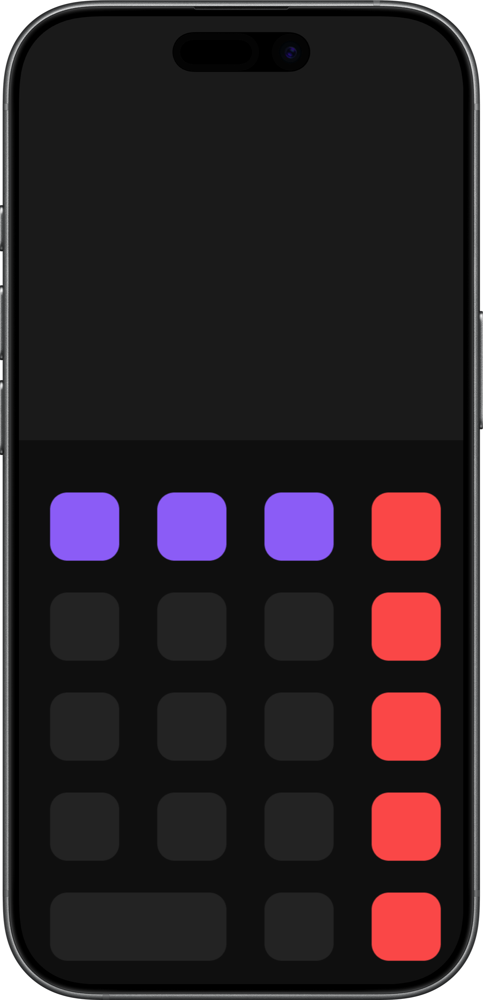
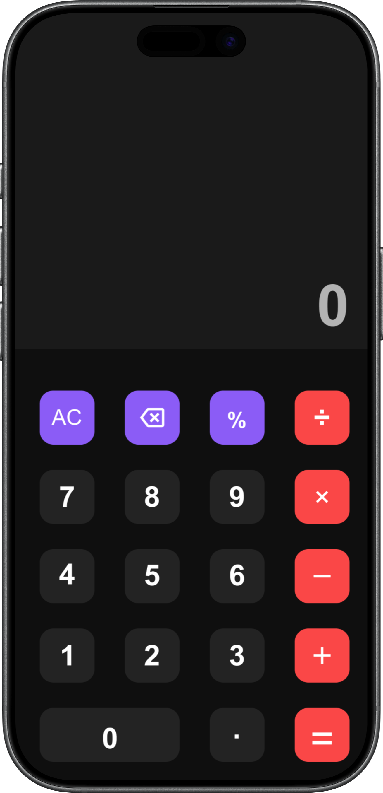

# Protótipo RNCalc

## Ferramenta Utilizada

- Figma
  
## Objetivo

Representar a ideia da interface da calculadora antes de sua implementação

## Tela principal

    
    

## Descrição

A interface é composta por:

- Nome da aplicação no título
- Visor para a exibição das expressões
- Grade de botões organizada em 4x5
- Botões de ação destacados
